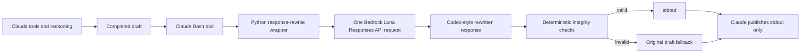
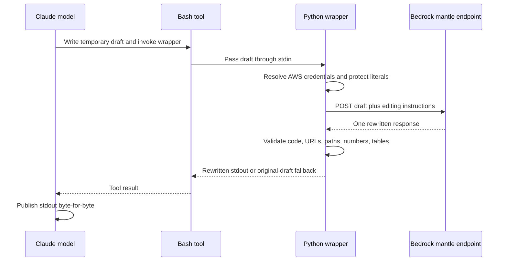

# Claude response tuning with Bedrock Luna

This repository contains a sanitized, one-call response formatter for Claude
Code Desktop. Claude performs the investigation and tool use; the local Python
wrapper sends the completed draft to Luna through Amazon Bedrock for a
Codex-style rewrite.

## Contents

- `bin/response-rewrite` — fail-safe Python 3 wrapper.
- `output-styles/response-rewrite.md` — strict Claude output protocol.
- `claude-response-tuning.md` — installation, configuration, verification, and
  troubleshooting guide.

The repository contains no credentials. Each user authenticates with their
existing AWS credential chain and configures their Claude settings. Read the
guide before installing.

## Architecture

The Bash tool is only the launcher and transport layer. The wrapper reads the
draft, builds the JSON request, calls Luna once, validates protected literals,
and returns either the rewrite or the original draft.

## Request boundary

See [claude-response-tuning.md](claude-response-tuning.md) for installation and
verification details.

## Configuration reference panels

These are sanitized, portable reference panels rather than live desktop
captures. They show the exact configuration locations without exposing AWS
credentials or Claude conversation data.

