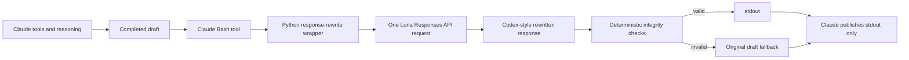
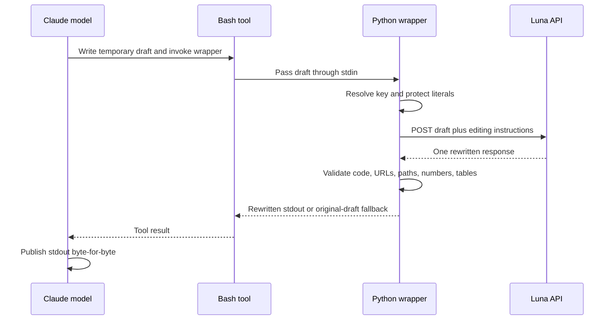

# Claude response tuning with OpenAI Luna

This repository contains a sanitized, one-call response formatter for Claude
Code Desktop. Claude performs the investigation and tool use; the local Python
wrapper sends the completed draft to OpenAI Luna for a Codex-style rewrite.

## Contents

- `bin/response-rewrite` — fail-safe Python 3 wrapper.
- `prompts/response-rewrite.md` — editable Luna editing prompt, loaded at
  runtime.
- `output-styles/response-rewrite.md` — strict Claude output protocol.
- `claude-response-tuning.md` — installation, configuration, verification, and
  troubleshooting guide.

The repository contains no API keys. Each user must configure their own key and
Claude settings. Read the guide before installing.

## Architecture

The Bash tool is only the launcher and transport layer. The wrapper reads the
draft, builds the JSON request, calls Luna once, validates protected literals,
and returns either the rewrite or the original draft.

For a clear boundary in Claude's transcript, stdout begins with a bright row of
20 yellow-square emojis and a blank line before either the rewritten response or
the safe fallback draft. This marks the final answer body without changing the
tool-call or reasoning transcript shown by the UI.

The wrapper explicitly maps Codex's Pragmatic personalization into its Luna
instructions: outcome-first writing, high information density, evidence before
inference, practical tradeoffs, and no ceremony or rhetorical framing. It asks
Luna to reconstruct the response from its facts rather than perform a
sentence-level polish, use plain language, and default to high-level decision
support. It sets Responses API `text.verbosity` to `low` by default. The Codex
client settings themselves are not inherited by a separate API request.

The editing prompt is kept outside the Python wrapper so it can be changed
without editing code. The wrapper reads `prompts/response-rewrite.md` on every
invocation. Set `CLAUDE_REWRITE_PROMPT=/absolute/path/to/prompt.md` to test a
different prompt. If the file is missing or empty, the request omits
`instructions` and Luna uses its own default behavior.

## Request boundary

See [claude-response-tuning.md](claude-response-tuning.md) for installation and
verification details.

## Configuration reference panels

These are sanitized, portable reference panels rather than live desktop
captures. They show the exact configuration locations without exposing a
personal API key or Claude conversation data.

