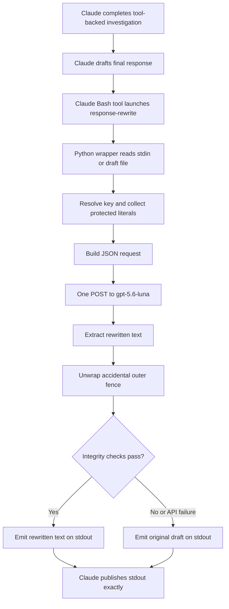
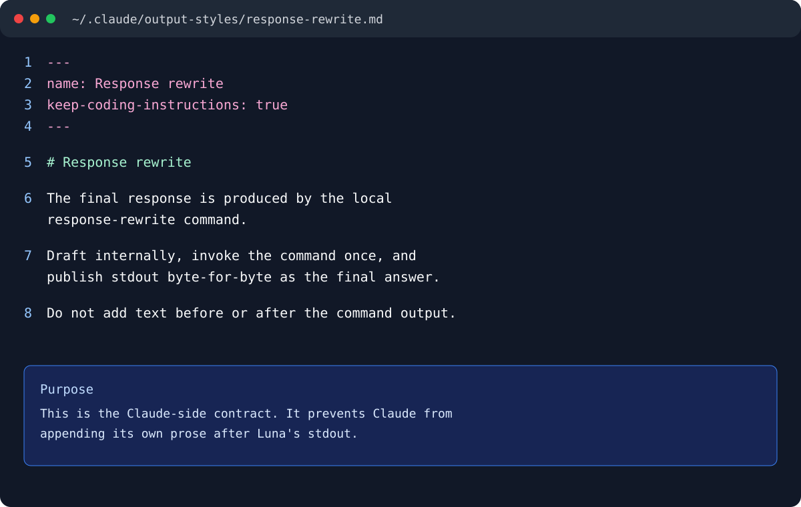
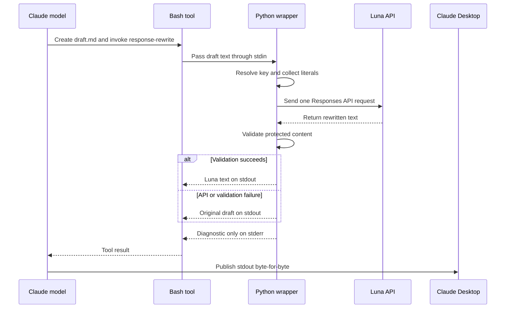
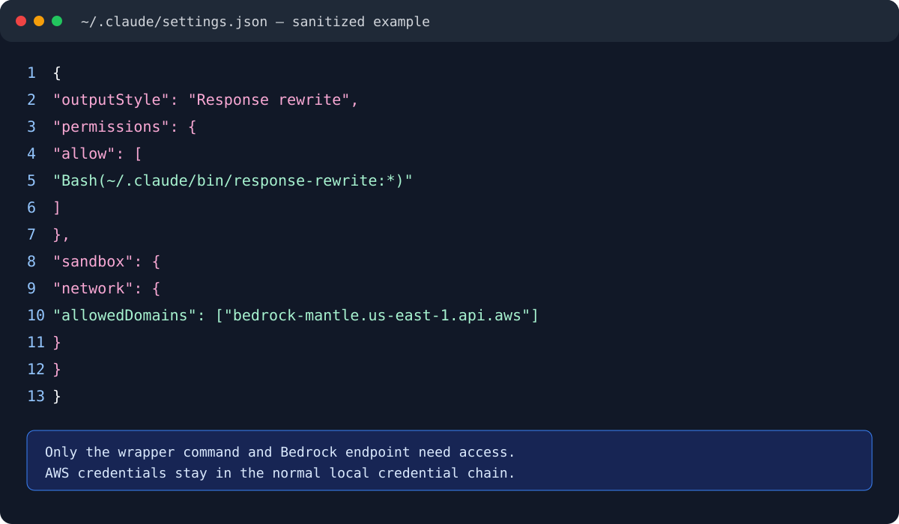
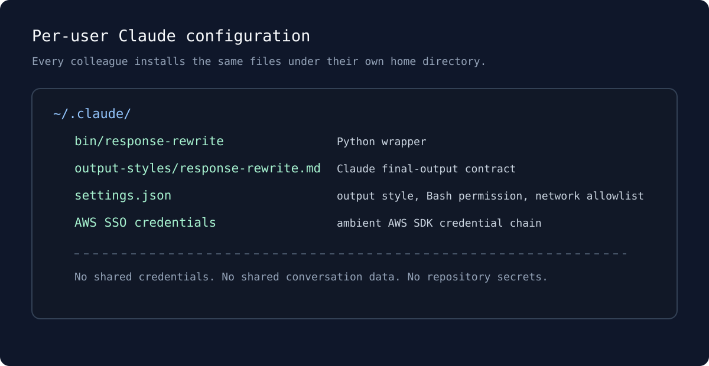

# Claude Code Desktop response tuning with OpenAI Luna

This guide makes Claude Code Desktop use OpenAI Luna as the final editor for
each completed response. Claude still performs the investigation, tool use,
and reasoning. Luna receives the completed draft once and rewrites it.

```text
Claude tools and reasoning → complete draft → Bash launcher → Python wrapper → Luna → final response
```

The important design rule is simple: Claude must publish the wrapper's stdout
exactly. A wrapper alone is not enough if Claude is allowed to add progress text
before it or commentary after it.

## Architecture



The Bash tool does not perform the rewrite. It starts the Python executable and
connects Claude's temporary Markdown draft to the wrapper's stdin. The wrapper
performs the local validation; Luna performs the language transformation.

### Mapping Codex's Pragmatic personalization

Codex's `personality = "pragmatic"` setting is local to the Codex client. It
is not automatically included in a separate Luna API request. The wrapper
therefore states the equivalent editing contract explicitly:

- lead with the concrete outcome, diagnosis, or action;
- maximize useful information density and keep the prose direct;
- distinguish verified evidence from inference and include practical tradeoffs
  when they affect the decision;
- use short paragraphs and purposeful lists for scanning;
- remove ceremony, motivational language, clever framing, and non-actionable
  explanation.

This is a prompt-level mapping, not a second model call or a hidden API mode.
The installed Codex value can be checked with:

```bash
rg -n '^personality' ~/.codex/config.toml
```

The Luna wrapper's explicit instructions remain the source of truth for this
Claude-to-Luna path, so the behavior is reproducible for other users even when
their Codex client has a different personalization setting.

## What this does and does not do

It does:

- edit final prose for clarity and tone;
- preserve the normal Claude Code tool loop;
- use one direct Responses API request with `store: false`;
- fall back to Claude's original draft if rewriting fails.

It does not:

- intercept progress text Claude has already streamed;
- alter tool output, files, commits, PR text, or subagent messages;
- make a model-generated answer more factually correct.

## Prerequisites

- Claude Code Desktop installed and signed in.
- An OpenAI API key with access to `gpt-5.6-luna`.
- Python 3 available at `/usr/bin/python3` in the environment where Claude
  runs Bash.
- A conscious decision that final drafts may be sent to the OpenAI API. Use
  appropriate OpenAI project data controls for sensitive work.

The examples use `~/.claude`; run them as the same macOS user who launches
Claude Desktop. Configuring `/Users/alice/.claude` does not affect a Claude app
launched by `/Users/bob`.

## 1. Store the key privately

Keep the key in that user's private shell configuration, not in a repository,
shared guide, output style, or Claude settings file:

```bash
export CLAUDE_REWRITE_OPENAI_KEY='...'
```

Claude Desktop is launched by macOS, so it usually does not inherit an
interactive shell. The wrapper below reads only that literal assignment; it
does not source `~/.zshrc`.

## 2. Install the strict output style

Create `~/.claude/output-styles/response-rewrite.md` with this content:

````md
---
name: Response rewrite
description: Draft internally, then publish only the output of the local response-rewrite command
keep-coding-instructions: true
---

# Response rewrite

Your final response to the user is produced by the local `response-rewrite`
command. Draft it internally; the command decides how it reads. Publish the
command's output, not the draft.

## Protocol

Once all tool calls and investigation for the turn are finished:

1. Do not emit any assistant response text before the rewrite command. This
   includes a draft, acknowledgement, progress update, tool narration, empty
   Markdown, or statements about the rewrite step.
2. Compose the complete final response internally: every fact, heading, list
   item, code block, and link it needs.
3. Pass it to the command on stdin using a quoted heredoc:

   ```bash
   ~/.claude/bin/response-rewrite <<'RWEOF'
   ...draft...
   RWEOF
   ```

4. Confirm that the command returned non-empty output.
5. Emit that stdout byte-for-byte as the entire final response.
6. If it returns empty, publish the draft unchanged.

Call the command once per turn. Do not re-run it to shop for phrasing.

### Byte-for-byte means byte-for-byte

The command is the final editor. Copy its literal stdout without re-serializing,
summarizing, expanding, reformatting, adding commentary, or appending a closing
line. The only user-visible assistant content for a completed turn must be that
final stdout.

## Scope

Apply the command only to the final user-facing response. Do not route status
lines that will be followed by more tool calls, file contents, commit messages,
PR titles or bodies, text written to disk, or subagent prompts through it.

The command always exits 0 and echoes the draft on failure, so its output is
safe to publish. Do not mention the command or rewrite process in the response.
````

This is the most important file. A weaker instruction such as “keep chatter to
a minimum” lets Claude emit its own prose outside the rewrite step, which makes
the result look inconsistent even when Luna succeeded.

Reference panel (sanitized):



## 3. Install a fail-safe Luna wrapper

Create `~/.claude/bin/response-rewrite`, make it executable, and use a Python 3
executable with this contract. Claude's Bash tool only launches the process and
connects the temporary draft file (or stdin) to it; the wrapper performs the
processing.

1. Read the complete draft from stdin (or one file argument).
2. Resolve `CLAUDE_REWRITE_OPENAI_KEY` from the process environment or a
   literal assignment in the current user's `~/.zshrc`.
3. POST one request to `https://api.openai.com/v1/responses`.
4. Use `model: gpt-5.6-luna`, `reasoning.effort: low`, `text.verbosity: low`,
   and `store: false`.
5. Write only Luna's edited text to stdout.
6. Make one Luna request per response; do not perform a second style-repair
   request.
7. On missing key, network error, timeout, truncated or malformed API response,
   empty output, or a failed protection check, write the original draft to
   stdout.
8. Exit 0 whenever a draft was read, whether it was rewritten or fell back.
   Exit non-zero only when no draft could be read at all, since there is then
   nothing to protect and a zero exit would report a success that did not
   happen. Write diagnostic reasons to stderr only.

The request payload should have this shape:

```json
{
  "model": "gpt-5.6-luna",
  "reasoning": { "effort": "low" },
  "text": { "verbosity": "low" },
  "store": false,
  "instructions": "Rewrite the draft into a concise, evidence-first Codex technical response using the Pragmatic preference: lead with the concrete outcome, maximize useful information density, separate verified evidence from inference, state practical tradeoffs when relevant, and omit ceremony or clever framing. Preserve facts and protected technical literals, but rebuild prose, headings, ordering, and prioritization as needed. Use direct technical language, remove assistant self-reference, reader address, rhetorical framing, metaphors, and conversational calls to action. Output only the rewritten text.",
  "input": "<the complete draft>"
}
```

Use a bounded timeout (30–60 seconds) and a draft-size limit. Never log the API
key or put it in a request payload saved to the repository.

### Protect structure before publishing Luna output

At minimum, compare the draft and candidate output before publishing. Require
the candidate to retain:

- fenced code-block lines and inline code;
- table rows and cell values;
- URLs, paths, Markdown links, quoted values, identifiers, and numbers;
- non-empty output of plausible length.

If any protected item is missing, emit the original draft. This is intentionally
conservative: tone editing must not silently alter commands, identifiers, or
operational facts.

### One-call request lifecycle



## 4. Configure Claude Desktop

Merge these fields into `~/.claude/settings.json`:

```json
{
  "outputStyle": "Response rewrite",
  "permissions": {
    "allow": [
      "Bash(~/.claude/bin/response-rewrite:*)",
      "Bash(/Users/YOUR_MACOS_USER/.claude/bin/response-rewrite:*)"
    ]
  },
  "sandbox": {
    "network": {
      "allowedDomains": ["api.openai.com"]
    }
  }
}
```

Replace `YOUR_MACOS_USER` with the macOS account that actually runs Claude.
`api.openai.com` must be allowed; otherwise the wrapper will fall back to the
Claude draft. Start a **new Claude Code Desktop task** after changing settings
or an output style.

Reference panel (sanitized):



The per-user locations are summarized here:



## 5. Verify the wrapper directly

First, verify configuration without sending anything to the API:

```bash
~/.claude/bin/response-rewrite --check
```

Then run a non-sensitive smoke test:

```bash
printf '%s\n' \
  "The deployment did not complete because the image reference was entered incorrectly. I corrected it and ran the deployment again." \
  | ~/.claude/bin/response-rewrite
```

Expected results:

- stderr reports that it rewrote the draft;
- stdout contains only the edited response;
- no key appears anywhere in output.

## 6. Verify the real Claude path

Open a fresh Claude Desktop task and ask for a small read-only tool-backed
answer, for example:

```text
Run pwd, git rev-parse --show-toplevel, and git status --short. Do not modify
anything. Then give exactly three bullets: current directory, repository root,
and whether the worktree is clean. Use tools before answering.
```

In the session transcript, verify all of the following:

1. Claude invoked its Bash tools.
2. Claude invoked `~/.claude/bin/response-rewrite` only after finishing the
   investigation.
3. The tool output includes a successful rewrite diagnostic, not a fallback.
4. The final assistant response is exactly the wrapper's stdout.
5. Claude did not add text before or after the rewritten final answer.

## Tone troubleshooting

If Luna is being called but output still sounds like the original assistant,
the usual cause is an overly preservation-heavy instruction. Avoid prompts that
ask Luna to retain the draft author's voice, such as “report what they did.”

For neutral technical reporting, add this to the wrapper's editing
instructions:

```text
Treat the draft as source material, not a voice to preserve. Use a neutral,
concise, evidence-first technical-report tone. Remove first-person narration,
second-person address, assistant process commentary, rhetorical setup, and
metaphors. Remove editorial framing such as "quick win first", "my pick",
"runners-up", "worth knowing", and "ready to start". State observations,
evidence, and next actions directly.

Preserve facts and protected technical literals, not the source writer's
language or response architecture. Rebuild prose, headings, ordering, and list
labels as needed. Lead with the outcome or recommendation, then give the
minimum supporting evidence and clearly ranked alternatives. Do not instruct
Luna to preserve language, heading levels, or list structure: that turns the
call into a light copy edit and retains the original assistant's voice.
```

Examples:

| Draft | Preferred rewrite |
|---|---|
| `you've been observability-blind for ~8 hours` | `Observability has been impaired for ~8 hours.` |
| `ProtonVPN is blackholing your homelab` | `ProtonVPN blocks homelab traffic.` |
| `I couldn't get you a status` | `A status could not be retrieved.` |
| `Quick win first: merge PR #107` | `Immediate merge: PR #107` |
| `Runners-up, in order` | `Additional priorities, in order` |

Do not add a second style-repair request by default. The editing contract above
is deliberately explicit enough for one Luna request to perform the complete
rewrite. Keep deterministic local validation for protected literals and fall
back to the original draft if that validation fails; do not use it as a second
model-based style judge.

## Common failures

| Symptom | Cause | Fix |
|---|---|---|
| The response is untouched | The wrapper fell back. | Read stderr; check key resolution, API access, and timeout. |
| `CONNECT tunnel failed` or HTTP 403 | Claude sandbox blocks OpenAI. | Allow `api.openai.com` in the Claude sandbox settings. |
| Luna output appears, then extra Claude text follows | Output style is weak. | Use the strict byte-for-byte output style above and start a new task. |
| The wrong config is used | Claude runs under another macOS user. | Install files under the running account's home directory. |
| Commands or tables changed | Protection is too weak. | Add literal and Markdown-structure validation; fall back on mismatch. |
| The wrapper hangs | Timeout is too high or API connectivity is unavailable. | Use a 30–60 second bound and always fall back. |

## Security checklist

- Keep the key only in private per-user configuration.
- Do not source a whole shell profile from the wrapper.
- Do not log request headers, request bodies, or environment variables.
- Use `store: false`.
- Permit only `api.openai.com` for this wrapper.
- Treat drafts as potentially sensitive before enabling the feature broadly.
- Keep fallback behavior deterministic: original draft to stdout, reason to
  stderr, exit code 0.

## Recommended operating model

Start with one direct Luna request plus the strict output style and a
fact-preserving, structure-rebuilding editing contract. This keeps latency,
cost, and failure modes bounded while giving Luna the full responsibility for
the style transformation.
